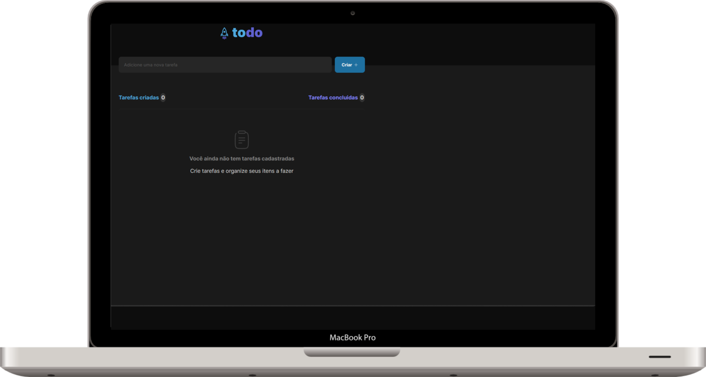

# Todo List 📚

<!---Esses são exemplos. Veja https://shields.io para outras pessoas ou para personalizar este conjunto de escudos. Você pode querer incluir dependências, status do projeto e informações de licença aqui--->
<h1>
  Tecnologias 👨‍💻
  </br>
  </br>
  <div align="center">
    
    
    
  </div>
</h1>

<p align="center">
  
</p>

> Link da aplicação: <a href="https://todo-list-one-pi.vercel.app/" target="_blank">Todo List</a>

</br>

## ✔️ Funcionalidades

Projeto concluido ✅:

- [x] Criar aplicativo com base no figma: <a href="https://www.figma.com/file/0n0zDN7zbzhRbaEO74Xesx/ToDo-List/duplicate" target="_blank">link</a>
- [x] Criar funcionalidade para a contagem de tarefas totais
- [x] Criar funcionalidade para a contagem de tarefas concluidas
- [x] Criar tarefa
- [x] Deletar tarefa
- [x] Concluir tarefa

## 🖖🏼 Objetivo

Criar um aplicativo de Todo List

## 💻 Pré-requisitos

Antes de começar, verifique se você atendeu aos seguintes requisitos:

<!---Estes são apenas requisitos de exemplo. Adicionar, duplicar ou remover conforme necessário--->

- Ter instalado o nodeJs
- Verificar se não tem nenhum processo rodando na porta: <strong>5173</strong>

## 🚀 Instalando Todo List

Para instalar o Todo List, siga estas etapas:

</br>

**Linux, macOS e Windows :**

**Clone o repositório**

```
  git clone https://github.com/rms-diego/todo-list.git && cd todo-list
```

Depois execute os seguintes comando

**Npm**

```
  npm i && npm run dev
```
